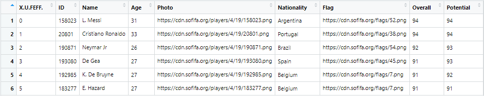

## Data Preprocessing (Version: 2, with R)

###### Preprocessing Script: [soccer-preprocessor.R](../code/soccer-preprocessor.R)

###### Processed Data: [soccer-preprocessed.csv](soccer-preprocessed.csv)

###### Unprocessed Data
1. Dimension: 18207 rows (Players) X 89 columns (Attributes)  
2. Overview  
  
 
  
 
  
 
  
 
  
 
  
 
  
 
  
 
  

###### Preprocessing (Steps)
**Step-1.** [features_removal]  
  
1. "X.U.FEFF",  
2. "ID",  
3. "Photo",  
4. "Flag",  
5. "Club.Logo",  
6. "Real.Face",  
7. "Joined",  
8. "Loaned.From",  
9. "Contract.Valid.Until"  
  
**Step-2.** [conversion]  
convert amount strings of "Value", "Wage", "Release.Clause" to numeric, e.g. €1M -> 1000000  
  
**Step-3.** [conversion]  
convert "Height" feet'inch values to cm e.g. 5'7 (5 feet 7 inch) -> 170 (cm)

**Step-4.** [conversion]  
convert "Weight" lbs values to kg e.g. 150lbs (150 pound) -> 68 (kg)  
  
**Step-5.** [conversion]  
position-wise  scores in columns (e.g. "LS", "ST", "RS" ...) are in format x+y,  
transformed to use only x value, removed +y, parsed into numerical value e.g. "80+2" -> 80  
  
**Step-6.** [conversion]  
converting to factor datatype for columns with catergorical values,  
e.g. "Nationality", "Club", "Preferred.Foot", "Work.Rate", "Body.Type", "Position"  
  
**Step-7.** [missing_value_handling]  
removing rows with missing value (NA) step wise  
  
**7a.** removing all rows missing "Height", "Weight", "Body.Type" etc.  
  
**7b.** removing all rows missing "Position"  
  
**7c.** removing all rows missing "Club"  
  
**7d.** imputing positional columns values to zero (0) for players with "Position"=GK  
  
**7e.** imputing missing "Release.Clause" values with zero (0)  
  
  
  
###### Processed Data  
1. Dimension: **17918** rows (Players) X **80** columns (Attributes)
  
  

## Data Preprocessing (Version: 1, with RapidMiner)  
  
latest contribution: ...noMissingValue

size: 17.891 players

features of removed players:
* no club
* no Value
* no body type
* no overall
