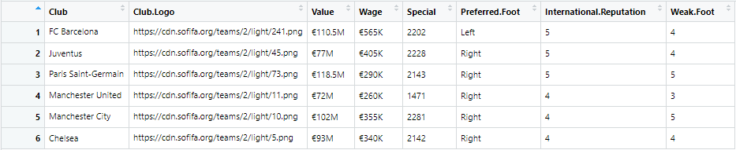
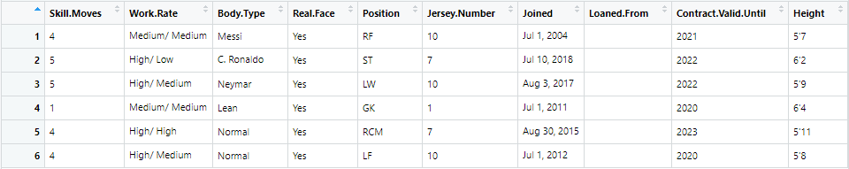
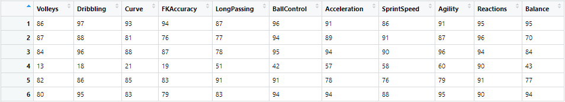
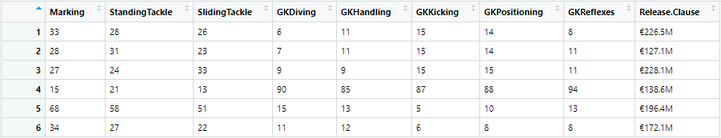

## Data Preprocessing (Version: 2, with R)

###### Data Overview
1. Dimension: 18207 rows (Players) X 89 columns (Attributes)  
2. Overview  
 
  
 
  
 
  
 
  
 
  
 
  
 
  
 

latest contribution: ...noMissingValue

size: 17.891 players

features of removed players:
* no club
* no Value
* no body type
* no overall
