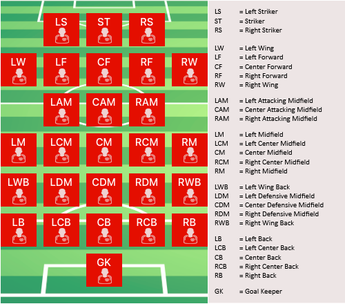

## Metadata

###### Description of Each Feature

01. ID							: id of the record\

02. Name						: name of the player\

03. Age							: age of the player\

04. Photo						: link to photo of the player\

05. Nationality					: name of the country to which the player belongs\

06. Flag						: link to photo of the country flag to which the player belongs\

07. Overall						: how much the player scored overall, range: 0-100\

08. Potential					: score for career mode of the game, as for "Career Mode" potential is important\

09. Club						: name of the club for which the player currently plays\

10. Club Logo					: link to photo of the club logo for which the player currently plays\

11. Value						: price of the player in Euro set by the club for which the player currently plays\

12. Wage						: amount of the salary of the player in Euro\

13. Special						: score of the player's "Flair" trait, high score means the player is special and can perform a "Rabona" cross\

14. Preferred Foot				: name of the player's preferred foot\

15. International Reputation	: how much popular in real world, range: 1-5\

16. Weak Foot					: rating of weak foot, having a 5-star weak foot rating means that a player's weaker foot shot is identical to their preferred foot shot\

17. Skill Moves					: skill rating, which gives an indication of the level of skill moves they can perform, 5-star skill players means they can perform every skill\

18. Work Rate					: attacking rating/defensive rating, it defines how a player puts effort to participate in attacks and defenses even when they are out of position\

13. Body Type					: what is the player's body type\

14. Real Face					: if the game uses real face\

15. Position					: at which position the player plays\

###### Player Positions as Layout

###### Resource
1. The following discussion thread in kaggle describes the features for this dataset:\
https://www.kaggle.com/karangadiya/fifa19/discussion/133113