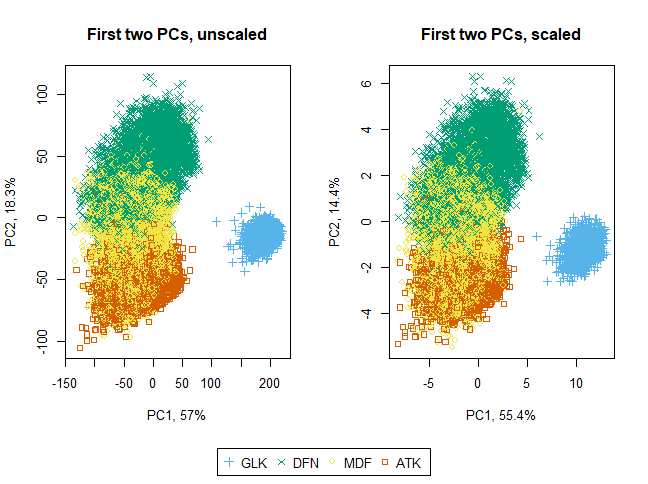
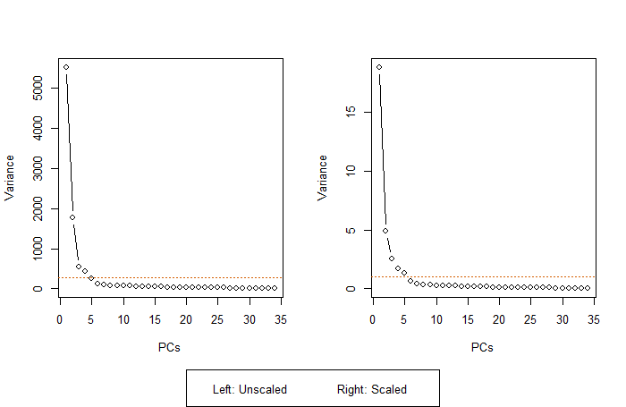

## PCA with Skill Scores

###### Selected Features  
  

###### Broader.Position  
  

###### PCA  
1. Using Broader.Position
2. Script: [soccer-pca-grouped-by-position.R](../code/soccer-pca-grouped-by-position.R), [soccer-pca-scree-plot.R](../code/soccer-pca-scree-plot.R)  
3. Plot  
  

  
4. Scree Plot  
  
  