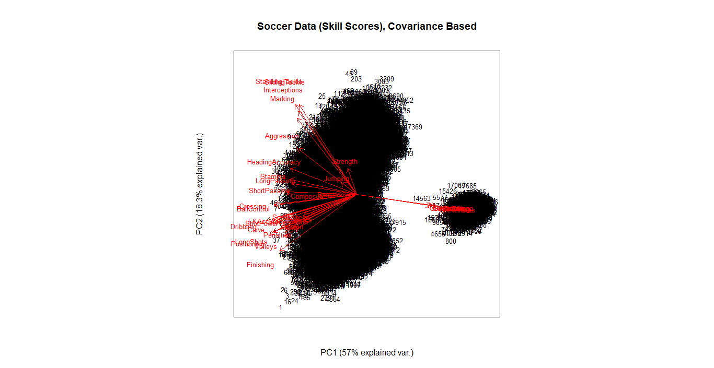
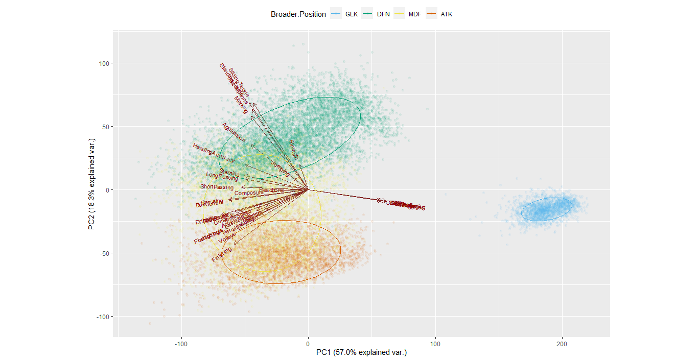

## PCA with Skill Scores

###### Selected Features  
  

###### Broader.Position  
  

###### PCA  
1. Scripts  
 a. [soccer-pca-grouped-by-position.R](../../code/soccer-pca-grouped-by-position.R)  
 b. [soccer-pca-scree-plot.R](../../code/soccer-pca-scree-plot.R)  
 c. [soccer-pca-biplot.R](../../code/soccer-pca-biplot.R)  
 d. [soccer-pca-ggbiplot.R](../../code/soccer-pca-ggbiplot.R)  
  
2. Using Broader.Position  
  
3. Scatter Plot (with first two PC axes)  
  

  
4. Scree Plot  
  
  
  
5. Biplot  
 a. With biplot() function  
  
  
  
 b. With ggbiplot() function  
  
  