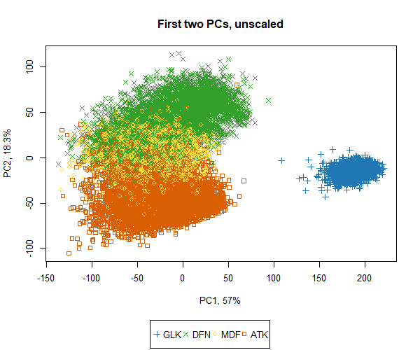

## PCA with Skill Scores

###### Selected Features  
  

  
###### PCA  
1. Scripts  
 a. [pca-skill-scores-with-playfield-broader-position.R](../../code/pca-skill-scores-with-playfield-broader-position.R)  
 b. [pca-skill-scores-with-correlated-broader-position.R](../../code/pca-skill-scores-with-correlated-broader-position.R)  
 c. [pca-skill-scores-with-correlated-broader-position-unscaled.R](../../code/pca-skill-scores-with-correlated-broader-position-unscaled.R)  
 d. [pca-skill-scores-screeplot.R](../../code/pca-skill-scores-screeplot.R)  
 e. [pca-skill-scores-biplot.R](../../code/pca-skill-scores-biplot.R)  
 f. [pca-skill-scores-ggbiplot.R](../../code/pca-skill-scores-ggbiplot.R)  
  
2. Using Broader.Position (based on positional layers in playfield)  
  

  
3. Scatter Plot - v1 (with scores in first two PC axes) (Scaled+Unscaled)  
  

  
4. Using Broader.Position (based on correlation of positional scores)  
  

  
5. Scatter Plot - v2 (with scores in first two PC axes)(Scaled + Unscaled)  
  

  
6. Scatter Plot - v2 (with scores in first two PC axes)(only Unscaled)  
  

  
7. Scree Plot  
  
  
  
8. Biplot - with biplot() function  
  

  
9. Biplot - with ggbiplot() function  
  
