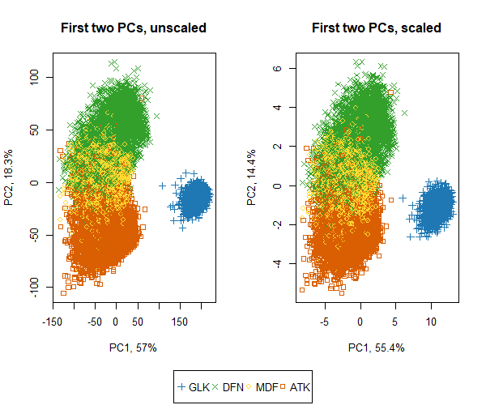

## PCA with Skill Scores
  
###### PCA
1. Color Palletes: [rcolorbrewer-color-blind-friendly-palletes.R](../../code/rcolorbrewer-color-blind-friendly-palletes.R)  
  

  
2. Selected Features  
  

  
3. Correlation among Skill Scores: [skill-scores-corrplot.R](../../code/skill-scores-corrplot.R)  
  

  
4. Using Broader.Position (based on positional layers in playfield)  
  

  
5. PCA Scatter Plot - v1 (Scaled + Unscaled): [pca-skill-scores-with-playfield-broader-position.R](../../code/pca-skill-scores-with-playfield-broader-position.R)  
  

  
6. Using Broader.Position (based on correlation of positional scores)  
  

  
7. PCA Scatter Plot - v2 (Scaled + Unscaled): [pca-skill-scores-with-correlated-broader-position.R](../../code/pca-skill-scores-with-correlated-broader-position.R)  
  

  
8. PCA Scatter Plot - v2 (only Unscaled): [pca-skill-scores-with-correlated-broader-position-unscaled.R](../../code/pca-skill-scores-with-correlated-broader-position-unscaled.R)  
  

  
9. Scree Plot: [pca-skill-scores-screeplot.R](../../code/pca-skill-scores-screeplot.R)  
  

10. Correlation among Skill Scores: [skill-scores-vs-pcs-corrplot.R](../../code/skill-scores-vs-pcs-corrplot.R)  
  

  
11. Biplot - with biplot(): [pca-skill-scores-biplot.R](../../code/pca-skill-scores-biplot.R)  
  

  
12. Biplot - with ggbiplot(): [pca-skill-scores-ggbiplot.R](../../code/pca-skill-scores-ggbiplot.R)  
  

  